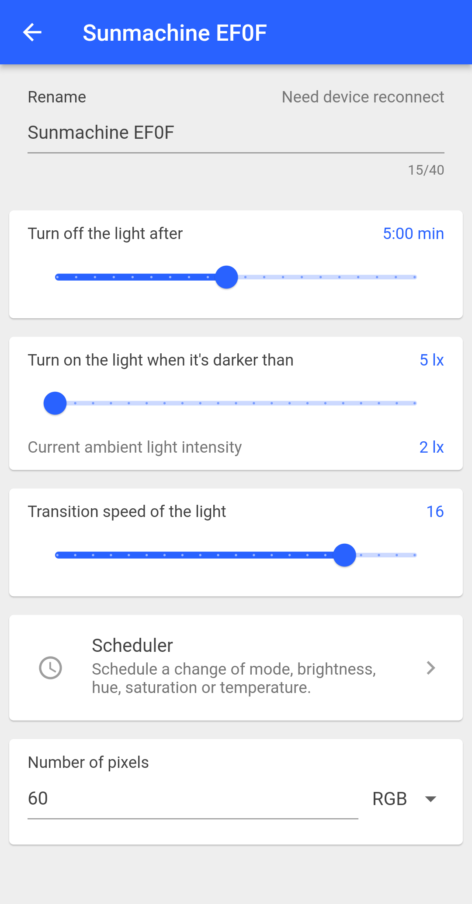

# Sunmachine-app
Sunmachine is an application to control smart lighting system.
The whole system includes the following elements:
- this application
- [printed circuit board](https://github.com/gblach/Sunmachine-A3-pcb)
- [firmware for the board](https://github.com/gblach/Sunmachine-A3-fw)
- WS2812-like LED strip
- 5V power supply

## Features
- Manual and auto operating modes.
- In auto mode, it uses motion and light sensors to turn the light on or off automatically.
- Supports WS2812, SK6812 or similar LED strips.
- Supports both RGB and WWA LEDs.
- Built-in scheduler that allows to change mode, brightness, hue, saturation or temperature at a specific time.

## First run
At first run you must open the configuration page and set the number of pixels and type of your LED strip.  Without this, the system will not function properly.

## Screenshots
|  |  |  |
| - | - | - |
|  |  |  |
